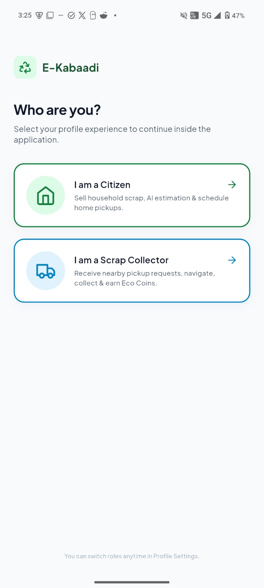
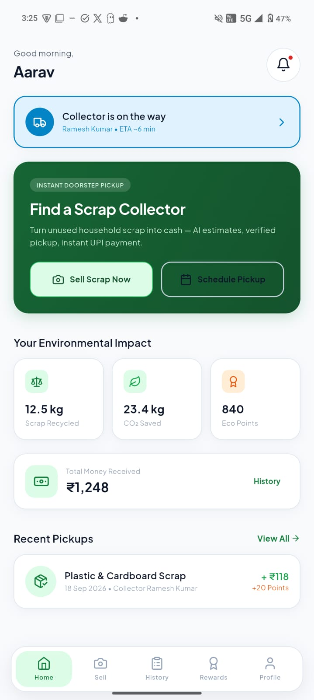
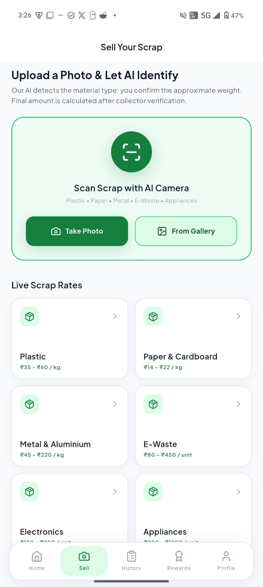
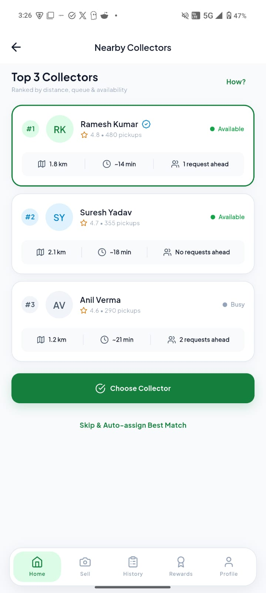
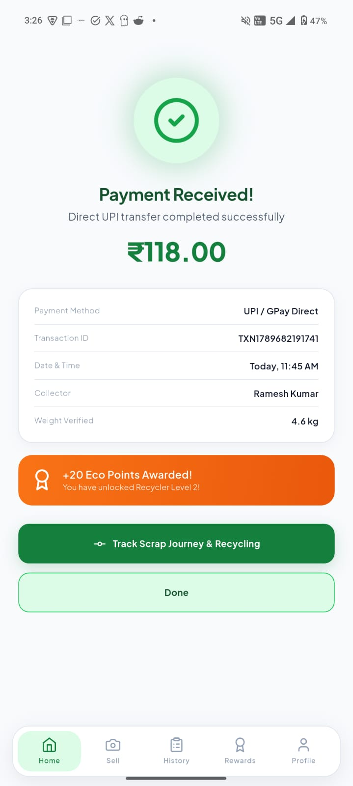
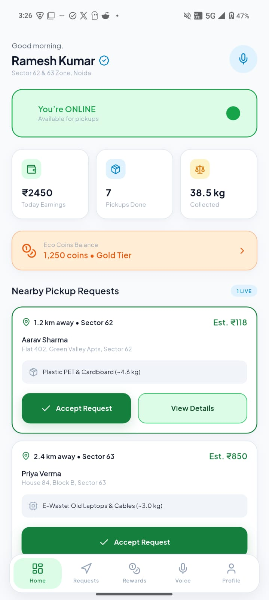
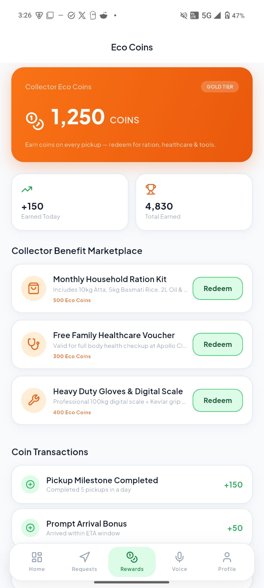

# ♻️ E-Kabadi

<p align="center">
  <strong>AI-Powered Smart Scrap Collection & Reward Ecosystem</strong>
</p>

<p align="center">
  Turning everyday waste into value for citizens, collectors, and the planet.
</p>

<p align="center">
  
  
  
  
  
</p>

<p align="center">
  <a href="#-prototype-preview">Prototype Preview</a> •
  <a href="#-problem">Problem</a> •
  <a href="#-solution">Solution</a> •
  <a href="#-features">Features</a> •
  <a href="#-tech-stack">Tech Stack</a> •
  <a href="#-getting-started">Getting Started</a>
</p>

---

## 📱 Prototype Preview

> **This section is intentionally placed near the top so hackathon judges can see the product experience immediately.**

### ♻️ E-Kabadi — From Scrap to Reward

<table>
  <tr>
    <td align="center" width="50%">
      
      <br><strong>Role Selection</strong><br>
      <sub>Choose between Citizen and Scrap Collector experiences.</sub>
    </td>
    <td align="center" width="50%">
      
      <br><strong>Citizen Dashboard</strong><br>
      <sub>Sell scrap, track environmental impact and view recent pickups.</sub>
    </td>
  </tr>
  <tr>
    <td align="center">
      
      <br><strong>AI Scrap Identification</strong><br>
      <sub>Capture or upload scrap and view material rates.</sub>
    </td>
    <td align="center">
      
      <br><strong>Nearby Collectors</strong><br>
      <sub>Compare availability, distance, queue and ratings.</sub>
    </td>
  </tr>
  <tr>
    <td align="center">
      
      <br><strong>Payment & Rewards</strong><br>
      <sub>UPI payment confirmation with Eco Points and scrap details.</sub>
    </td>
    <td align="center">
      
      <br><strong>Collector Dashboard</strong><br>
      <sub>Go online, manage pickup requests and track earnings.</sub>
    </td>
  </tr>
  <tr>
    <td align="center" colspan="2">
      
      <br><strong>Eco Coin Marketplace</strong><br>
      <sub>Collectors earn Eco Coins and redeem them for ecosystem benefits.</sub>
    </td>
  </tr>
</table>

---

# 🌍 About E-Kabadi

**E-Kabadi** is a smart scrap collection platform that digitally connects **citizens, scrap collectors and administrators** in one ecosystem.

The platform is designed around a simple idea:

> ### Make recycling as easy as ordering a service.

E-Kabadi combines AI-assisted scrap identification, scrap-rate information, location-based collector discovery, pickup workflows, digital payments and incentive mechanisms into one experience.

### The core journey

```text
📸 Capture Scrap
       ↓
🤖 AI-Assisted Identification
       ↓
💰 Value Estimation
       ↓
📍 Find / Assign Collector
       ↓
🚛 Scrap Pickup
       ↓
💳 Digital Payment
       ↓
🎁 Rewards
       ↓
♻️ Recycling
```

---

# 🚨 Problem

Traditional scrap collection can be:

- Difficult to arrange
- Dependent on phone calls and local contacts
- Unclear about material prices
- Manual and time-consuming
- Difficult to track from request to completion
- Limited in digital incentives
- Inefficient for both citizens and collectors

At the same time, recyclable materials with economic value can be lost in mixed-waste streams.

E-Kabadi addresses this by creating a structured digital workflow between the person generating scrap and the person collecting it.

---

# 💡 Solution

E-Kabadi provides three connected experiences.

### 👤 Citizen

```text
Sell Scrap
   ↓
Upload / Capture Image
   ↓
AI-Assisted Identification
   ↓
View Scrap Rates / Estimate
   ↓
Choose Collector
   ↓
Pickup
   ↓
UPI Payment
   ↓
Eco Points
```

### 🚛 Scrap Collector

```text
Go Online
   ↓
Receive Nearby Requests
   ↓
View Scrap & Estimated Value
   ↓
Accept Request
   ↓
Navigate to Citizen
   ↓
Collect & Verify
   ↓
Complete Transaction
   ↓
Earn Eco Coins
```

### 🖥️ Admin

The administrative layer provides a foundation for managing users, collectors, transactions, pricing, rewards and platform operations.

---

# ✨ Features

## 👤 Citizen Experience

### 📸 AI-Assisted Scrap Identification

Citizens can take a photo using the camera or select one from the gallery.

The prototype presents an AI-assisted workflow for identifying material categories such as:

- Plastic
- Paper & Cardboard
- Metal & Aluminium
- E-Waste
- Electronics
- Appliances

---

### 💰 Scrap Rate Discovery

The Sell Scrap screen presents material-wise scrap rates so users have a clearer understanding of potential value.

Example prototype rates include:

| Material | Prototype Rate |
|---|---:|
| Plastic | ₹35 – ₹60 / kg |
| Paper & Cardboard | ₹14 – ₹22 / kg |
| Metal & Aluminium | ₹45 – ₹220 / kg |
| E-Waste | ₹80 – ₹450 / unit |
| Electronics | Prototype rate |
| Appliances | Prototype rate |

> Rates shown in the prototype are demonstration data and should be replaced with verified live market data for production.

---

### 📍 Nearby Collector Matching

Citizens can compare nearby collectors using:

- Distance
- Estimated arrival time
- Availability
- Current queue
- Rating
- Previous pickup count

The prototype also provides an **auto-assignment** option for selecting a suitable collector.

---

### 💳 Digital Payment

After collection, the citizen receives a transaction confirmation showing:

- Payment amount
- Payment method
- Transaction ID
- Date & time
- Collector
- Verified weight
- Eco Points earned

The prototype demonstrates a **UPI / GPay Direct** payment confirmation experience.

---

### 🎁 Citizen Eco Points

The prototype uses a threshold-based citizen reward model:

```text
Bill ≥ ₹500
      ↓
10% of bill value
      ↓
Citizen Eco Points
```

Example:

```text
Bill = ₹800

Eco Points = 10% × ₹800
           = ₹80
```

---

## 🚛 Collector Experience

### 🟢 Online Status

Collectors can switch their availability and receive pickup requests while online.

### 📦 Nearby Pickup Requests

Collectors can see:

- Citizen name
- Location
- Distance
- Scrap type
- Approximate weight
- Estimated transaction value
- Request status

### 🗺️ Navigation

Location information supports the pickup journey from collector to citizen.

### 💰 Earnings Dashboard

Collectors can view:

- Today's earnings
- Pickups completed
- Scrap collected
- Eco Coin balance

### 🪙 Eco Coins

Collectors earn Eco Coins on completed transactions.

```text
Every Completed Transaction
            ↓
           10%
            ↓
       Eco Coins
```

There is no minimum transaction threshold for collector Eco Coins in the prototype model.

---

## 🎁 Eco Coin Marketplace

Collectors can redeem accumulated Eco Coins for supported benefits.

The prototype demonstrates categories such as:

- 🛒 Household ration
- 🏥 Healthcare benefits
- 🛠️ Tools and equipment

Example:

```text
500 Coins → Monthly Household Ration Kit
300 Coins → Healthcare Voucher
400 Coins → Gloves + Digital Scale
```

---

# 🔄 End-to-End Workflow

```text
                         ♻️ E-KABADI
                              │
              ┌───────────────┴───────────────┐
              │                               │
              ▼                               ▼
          👤 CITIZEN                      🚛 COLLECTOR
              │                               │
        Upload Scrap                    Go Online
              │                               │
              ▼                               ▼
       🤖 AI Identification             Pickup Requests
              │                               │
              ▼                               ▼
        💰 Estimation                    Accept Pickup
              │                               │
              └───────────────┬───────────────┘
                              ▼
                       📍 Collection
                              │
                              ▼
                       ⚖️ Verification
                              │
                              ▼
                       💳 Digital Payment
                              │
                 ┌────────────┴────────────┐
                 ▼                         ▼
           👤 Eco Points             🚛 Eco Coins
                 │                         │
                 └────────────┬────────────┘
                              ▼
                         ♻️ RECYCLING
```

---

# 🧠 AI Layer

AI is used as an assistance layer in the scrap-selling workflow.

### Current prototype concept

```text
Scrap Image
    ↓
AI-Assisted Classification
    ↓
Material Category
    ↓
Pricing / Estimation Workflow
```

### Future AI capabilities

The platform can be extended with:

- Multi-material detection
- Detection confidence scores
- Quantity / weight estimation
- Contamination detection
- Image quality validation
- Price recommendation
- Historical price analysis
- Demand prediction
- AI-powered route optimization

---

# 📍 Smart Collector Matching

The collector selection interface demonstrates a multi-factor matching concept.

Collectors can be compared using:

```text
Distance
   +
Availability
   +
Queue
   +
Rating
   +
Pickup History
```

This allows the system to move beyond simply selecting the geographically closest collector.

The prototype also provides:

> **Skip & Auto-assign Best Match**

for a more automated experience.

---

# 🪙 Dual Reward System

E-Kabadi separates rewards for citizens and collectors.

| Participant | Reward | Prototype Rule |
|---|---|---|
| 👤 Citizen | Eco Points | 10% when bill ≥ ₹500 |
| 🚛 Collector | Eco Coins | 10% on every completed transaction |

This creates two incentive loops:

```text
CITIZEN
   ↓
Sell More Recyclables
   ↓
Receive Eco Points
   ↓
More Participation
```

```text
COLLECTOR
   ↓
Complete More Pickups
   ↓
Earn Eco Coins
   ↓
Redeem Benefits
   ↓
More Participation
```

---

# 🏗️ System Architecture

```text
                    ┌───────────────────────┐
                    │       E-KABADI        │
                    │      APPLICATION      │
                    └───────────┬───────────┘
                                │
              ┌─────────────────┼─────────────────┐
              │                 │                 │
              ▼                 ▼                 ▼
       ┌────────────┐    ┌────────────┐    ┌────────────┐
       │   CITIZEN  │    │ COLLECTOR  │    │   ADMIN    │
       │ EXPERIENCE  │    │ EXPERIENCE │    │   PANEL    │
       └──────┬─────┘    └──────┬─────┘    └──────┬─────┘
              │                 │                 │
              └─────────────────┼─────────────────┘
                                ▼
                    ┌───────────────────────┐
                    │  APPLICATION LOGIC    │
                    └───────────┬───────────┘
                                │
           ┌────────────────────┼────────────────────┐
           │                    │                    │
           ▼                    ▼                    ▼
      ┌───────────┐       ┌────────────┐       ┌────────────┐
      │ AI LAYER  │       │  LOCATION  │       │ TRANSACTION│
      │           │       │  SERVICES  │       │  & REWARD  │
      └───────────┘       └────────────┘       └────────────┘
```

---

# 🛠️ Tech Stack

| Technology | Purpose |
|---|---|
| **Flutter** | Cross-platform application |
| **Dart** | Programming language |
| **Riverpod** | State management |
| **GoRouter** | Navigation and routing |
| **Google Fonts** | Typography |
| **Flutter Animate** | UI animations |
| **Lucide Icons** | Interface icons |
| **Intl** | Formatting and localization utilities |
| **AI Services** | Scrap identification / assistance |
| **Geolocation / Maps** | Collector discovery and navigation |
| **Admin Panel** | Platform administration |

---

# 📂 Project Structure

```text
E-Kabadi-Hackathon-prototype/
│
├── 📱 lib/
│   ├── Screens
│   ├── Widgets
│   ├── Models
│   ├── Providers
│   └── Application logic
│
├── 🖥️ admin-panel/
│   └── Administrative interface
│
├── 🎨 assets/
│   └── images/
│
├── 📸 docs/
│   └── screenshots/
│       ├── 01-role-selection.jpeg
│       ├── 02-citizen-home.jpeg
│       ├── 03-sell-scrap.jpeg
│       ├── 04-nearby-collectors.jpeg
│       ├── 05-payment-received.jpeg
│       ├── 06-collector-dashboard.jpeg
│       └── 07-eco-coins.jpeg
│
├── 🤖 android/
├── 🍎 ios/
├── 🌐 web/
├── 🪟 windows/
├── 🐧 linux/
├── 🍎 macos/
│
├── 🧪 test/
├── pubspec.yaml
├── pubspec.lock
└── README.md
```

---

# 🚀 Getting Started

## Prerequisites

Install:

- Flutter SDK
- Dart SDK
- Android Studio / VS Code
- Android SDK
- Git
- Android Emulator or physical Android device

Verify your environment:

```bash
flutter doctor
```

---

## 📥 Installation

### 1. Clone the repository

```bash
git clone https://github.com/Atharv-gif/E-Kabadi-Hackathon-prototype.git
```

### 2. Open the project

```bash
cd E-Kabadi-Hackathon-prototype
```

### 3. Install dependencies

```bash
flutter pub get
```

### 4. Check available devices

```bash
flutter devices
```

### 5. Run the application

```bash
flutter run
```

---

# 📱 Android Build

To create a release APK:

```bash
flutter build apk --release
```

The generated APK will be available under:

```text
build/app/outputs/flutter-apk/
```

---

# 🧪 Testing & Analysis

Run tests:

```bash
flutter test
```

Run static analysis:

```bash
flutter analyze
```

---

# 🎨 Design System

E-Kabadi follows a clean, modern and eco-focused interface.

### Visual direction

- 🌱 Green-first sustainability identity
- 🔵 Blue accents for collector workflows
- 🟠 Orange accents for rewards
- 🧼 Clean white surfaces
- 📱 Mobile-first layouts
- ✨ Subtle animations
- 🎯 Clear call-to-action buttons
- 📊 Card-based information architecture

### UX principles

**Simple → Clear → Fast → Rewarding**

The interface is designed so a first-time user can understand the core journey without needing technical knowledge.

---

# 🎯 Hackathon Prototype Scope

This repository represents a **hackathon prototype / proof of concept**.

The prototype focuses on demonstrating:

- Citizen experience
- Collector experience
- Scrap identification workflow
- Scrap rate discovery
- Collector matching
- Pickup workflow
- Digital payment experience
- Eco Points
- Eco Coins
- Reward marketplace
- Administrative ecosystem

Some values, transactions, identities, rates and integrations shown in the prototype are demonstration data.

For a production system, these would be connected to verified services and secure backend infrastructure.

---

# 🔐 Production Considerations

Before production deployment, the following would require additional engineering:

- Secure authentication
- Role-based authorization
- Collector KYC / verification
- Secure payment processing
- Verified market-rate feeds
- Production AI model/API
- Location privacy and consent
- Fraud detection
- Secure cloud database
- Audit logs
- Data encryption
- Notification infrastructure
- Scalable backend
- Regulatory and compliance review

---

# 🔮 Roadmap

## Phase 1 — Hackathon Prototype

- [x] Citizen workflow
- [x] Collector workflow
- [x] AI-assisted identification concept
- [x] Scrap rate interface
- [x] Collector matching
- [x] Pickup workflow
- [x] Payment confirmation
- [x] Citizen Eco Points
- [x] Collector Eco Coins
- [x] Eco Coin marketplace
- [x] Admin interface

## Phase 2 — Production Platform

- [ ] Production backend
- [ ] Real-time scrap market rates
- [ ] Verified collectors
- [ ] Secure UPI/payment integration
- [ ] Real-time location tracking
- [ ] Automated collector assignment
- [ ] Push notifications
- [ ] Analytics dashboard
- [ ] Fraud prevention

## Phase 3 — Smart Circular Economy

- [ ] 🧠 Advanced AI material recognition
- [ ] ⚖️ AI-based weight estimation
- [ ] 🚛 AI route optimization
- [ ] 📊 Waste-generation analytics
- [ ] 📈 Predictive scrap pricing
- [ ] 🌱 Carbon-credit integration
- [ ] 📡 IoT collection tracking
- [ ] 🏭 B2B recycling marketplace
- [ ] 🏛️ Municipal integration
- [ ] 🌍 Regional recycling intelligence

---

# 🌱 Environmental Impact Vision

The long-term goal is to make recyclable waste easier to identify, collect and route toward appropriate recycling channels.

```text
Better Identification
        ↓
Better Segregation
        ↓
Organized Collection
        ↓
Higher Recycling Participation
        ↓
Better Resource Recovery
        ↓
♻️ Circular Economy
```

E-Kabadi aims to create a system where waste is treated not simply as something to dispose of, but as a recoverable resource.

---

# 💡 Future Use Cases

The platform can be extended beyond individual households.

### 🏢 Businesses

Schedule bulk scrap pickups.

### 🏫 Schools & Universities

Run recycling drives and reward participation.

### 🏘️ Housing Societies

Create scheduled community collection programs.

### 🏭 Recycling Facilities

Connect recyclers with structured material supply.

### 🏛️ Municipal Bodies

Use aggregated insights to understand local waste patterns.

---

# 🏆 Why E-Kabadi?

E-Kabadi connects multiple parts of the scrap ecosystem:

```text
       🤖 AI
        │
        ▼
   ♻️ IDENTIFICATION
        │
        ▼
   💰 VALUATION
        │
        ▼
   📍 MATCHING
        │
        ▼
   🚛 COLLECTION
        │
        ▼
   💳 PAYMENT
        │
        ▼
   🎁 REWARDS
        │
        ▼
   🌱 RECYCLING
```

Instead of solving only one step, E-Kabadi brings together:

**Identification + Valuation + Collection + Location + Payment + Incentives**

into one digital experience.

---

# 👥 Team

<p align="center">

## 🚀 Team WeDev

<strong>Building technology for a cleaner, smarter and more sustainable future.</strong>

</p>

---

# 🏁 Hackathon Submission

### Project

# ♻️ E-Kabadi

### One-Line Pitch

> **An AI-powered digital ecosystem that connects citizens and scrap collectors while turning recyclable waste into value and rewards.**

### Core Technologies

**Flutter • Dart • Riverpod • GoRouter • AI • Geospatial Services • Digital Payments • Admin Dashboard**

---

# 🌍 Vision

## **Turn Waste Into Value.**

Recycling should be:

**Simple. Digital. Transparent. Rewarding. Sustainable.**

---

<p align="center">

# ♻️ E-Kabadi

### <i>Every Scrap Has Value. Let's Unlock It.</i>

<br><br>

<strong>Made with ❤️ by Team WeDev</strong>

</p>
